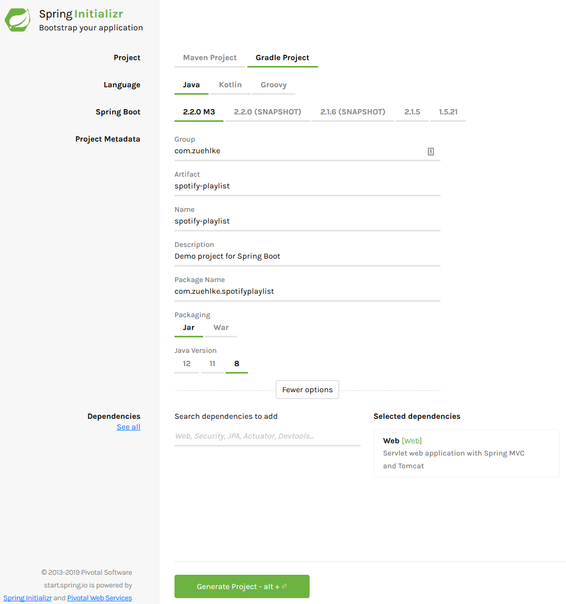
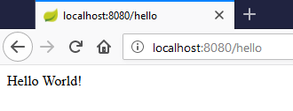
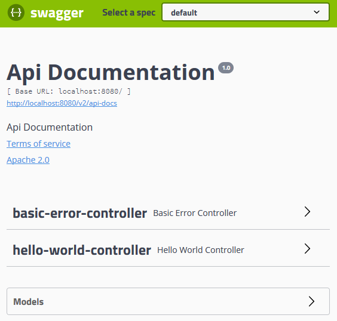

# First Spring Boot application

In this chapter you will learn how to bootstrap a Spring Boot application using SpringInitializr.
You will learn how to create a REST endpoint.

## Initialize the project

1. Navigate to <https://start.spring.io>
2. Create a new project with Gradle and Java 8.
Select Spring Boot version 2.2.0 M3.
Name the artifacts and group according the the following image.
Add `Web` as a dependency.

    

3. Click on `Generate Project` (or hit `Alt`+`Enter`) to download the generated project skeleton.
4. Extract the downloaded archive and import the Gradle project in the IDE of your choice.
In IntelliJ create a new project from existing sources.
Make sure to tick the `Enable auto-import` checkbox in the last step of the dialog.
5. Start the `SpotifyPlaylistApplication`.
In the logs you should be able to see, that the Tomcat server has been started on port 8080:

    ```bash
    2019-05-20 15:31:02.200  INFO 17572 --- [           main] o.s.b.w.embedded.tomcat.TomcatWebServer  : Tomcat started on port(s): 8080 (http) with context path ''
    ```

## Implement your first REST endpoint

1. Create the file `HelloWorldController.java`
2. Insert the following content.
The `@RestController` tells Spring Boot that this is a REST endpoint.
The `@GetMapping` defines an endpoint, which can be accessed with the HTTP GET method.
For the other HTTP methods like POST, PUT, DELETE, ... the corresponding annotations also exist.

    ```java
    @RestController
    public class HelloWorldController {

        @GetMapping("/hello")
        public String helloWorld() {
            return "Hello World!";
        }

    }
    ```

3. Restart your Spring Boot application.
4. Visit <http://localhost:8080/hello> in your browser.
You should be able to see the `Hello World!` message from your server.

    

## Add Swagger

[Swagger](https://swagger.io/) is a tool for documenting and testing REST endpoints.
The integration with Spring Boot is very easy.

1. Add Swagger in the `dependencies` section of your `build.gradle` file:

    ```groovy
    dependencies {
        // ...
        implementation 'io.springfox:springfox-swagger2:2.9.2'
        implementation 'io.springfox:springfox-swagger-ui:2.9.2'
        implementation 'org.springframework.plugin:spring-plugin-core:1.2.0.RELEASE'
    }
    ```

2. Create the file `SwaggerConfig.java` along the `SpotifyPlaylistApplication.java` file.
Insert the following content:

    ```java
    @Configuration
    @EnableSwagger2
    public class SwaggerConfig {
        @Bean
        public Docket api() {
            return new Docket(DocumentationType.SWAGGER_2)
                    .select()
                    .apis(RequestHandlerSelectors.any())
                    .paths(PathSelectors.any())
                    .build();
        }
    }
    ```

3. Restart your Spring Boot application and navigate to <http://localhost:8080/swagger-ui.html>.

    

4. Open the hello-world-controller and click on the `Get` request.
Click then on `Try it out` and execute the request from the Swagger UI.

## Tracking the application in Git

Before you can deploy your app to Heroku, you need to initialize a local Git repository and commit your application code to it.

```bash
git init
git add .
git commit -m "My first commit"
```

## Deploy the application to Heroku

1. Login using your Heroku credentials.

    ```bash
    heroku login -i
    ```

2. The heroku `create` CLI command creates a new empty application on Heroku, along with an associated empty Git repository. The Git repository is automatically set as a remote for your local repository.

    ```bash
    heroku apps:create <APPLICATION NAME> --region eu
    ```

3. Deploying the application

    ```bash
    git push heroku master
    ...
    https://<APPLICATION NAME>.herokuapp.com/ deployed to Heroku
    ```

::: tip EXERCISE

* Test the deployed application using the Swagger UI.

:::